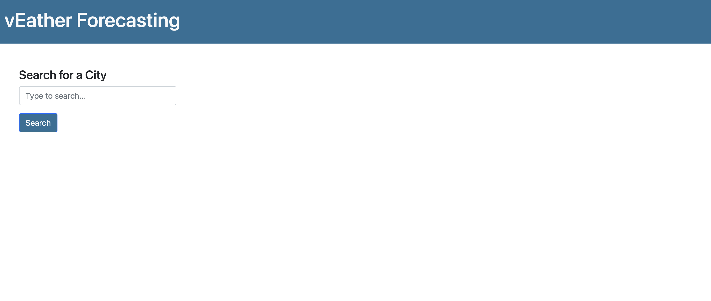
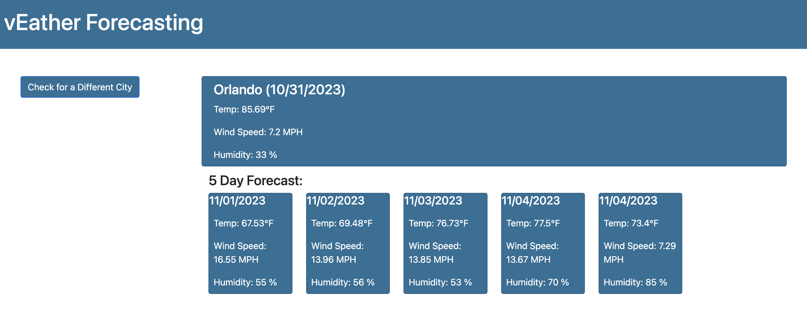

# vEatherForecasting

## Description

This webpage was created to demonstrate the knowledge gained in the Server-Side APIs week in coding boot camp and as a part of the class assignment submission. The vEather (Weather, instead of W, I used my initial) was developed using HTML, CSS, JS technology, and third-party APIs like jQuery, Bootstrap, and Dayjs. The application displays the weather forecast for five(5) days for selected cities from the list. The application uses two different APIs to fetch the data. The geocoding API will give us the latitude and longitude of the selected location. These values are passed to the weather API to retrieve the five-day forecasting.

## Installation

N/A

## Usage

To access the webpage, use the below link to access https://vigneshwarie.github.io/vEatherForecasting/

The application source code can be accessed here https://github.com/Vigneshwarie/vEatherForecasting

The code can be downloaded from the above link. To use this webpage, click the HTML page, which will open in the browser. The view the code, open the webpage in an HTML editor. When opened in a browser, the HTML page is viewed as below.

## API Details

Geocoding API - https://api.api-ninjas.com/v1/geocoding
Open Weather API - http://api.openweathermap.org/data/2.5/forecast
API Keys can be retrieved from the script file located in the repo

## Credits

Geocoding API - https://api.api-ninjas.com/v1/geocoding
Open Weather API - http://api.openweathermap.org/data/2.5/forecast

## License

Please refer to the LICENSE in the repo.

